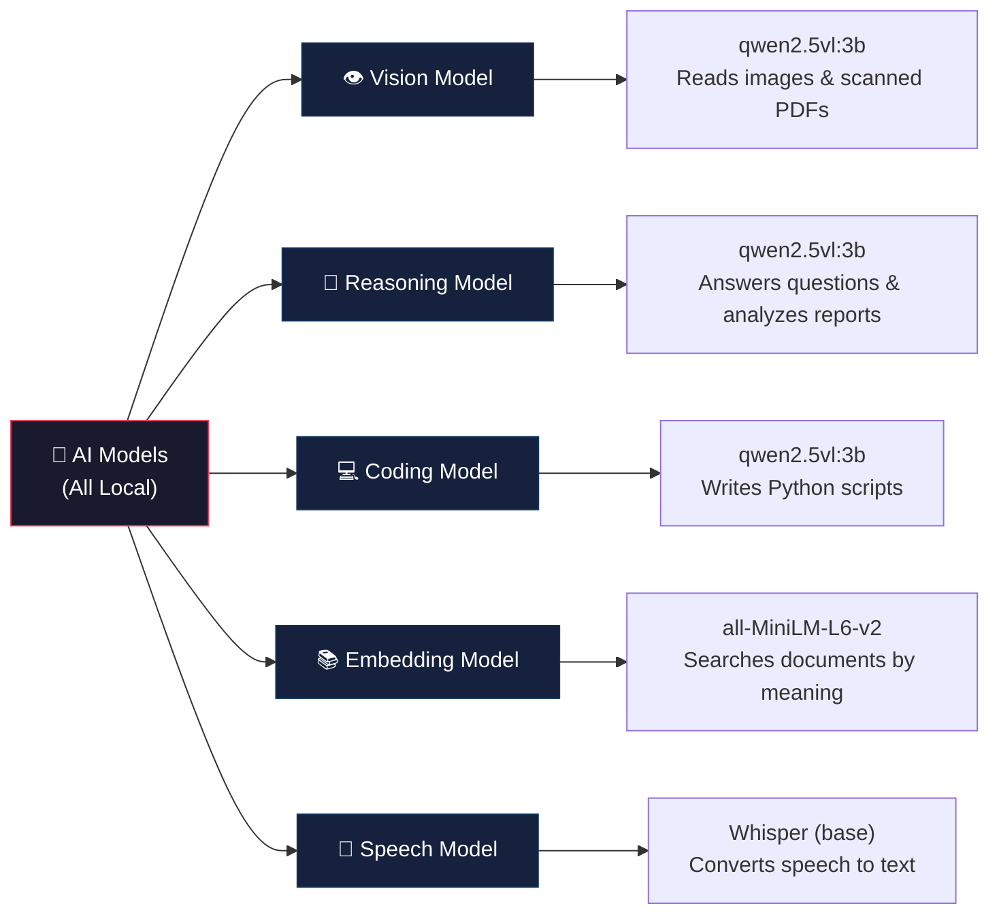
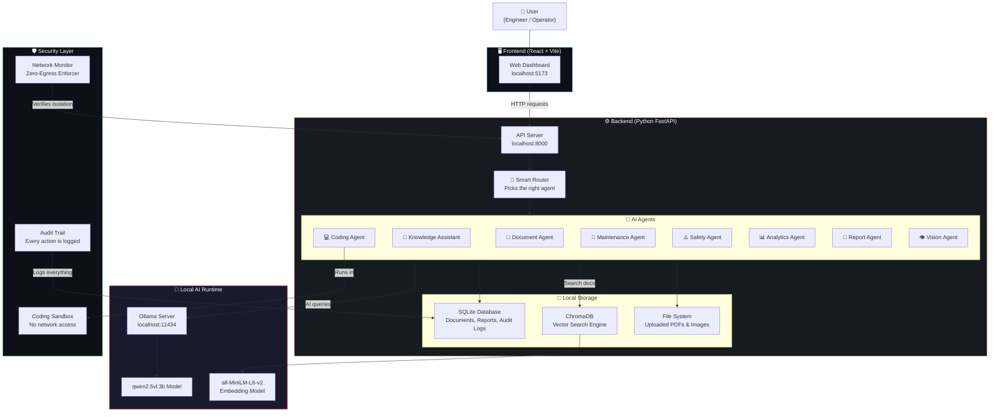
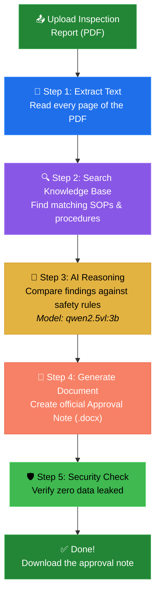
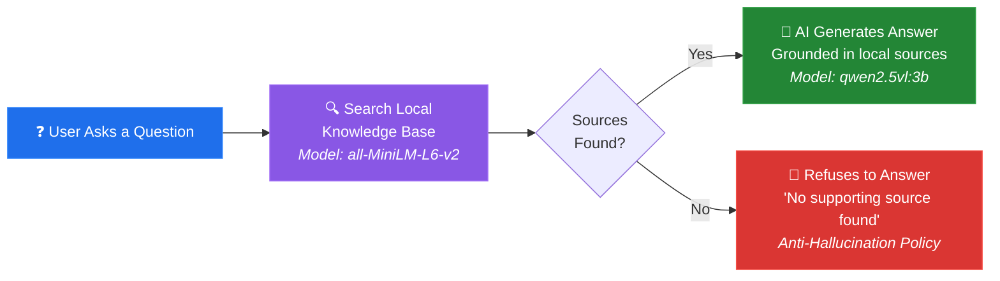
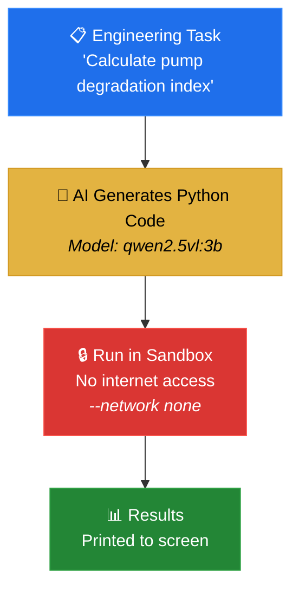
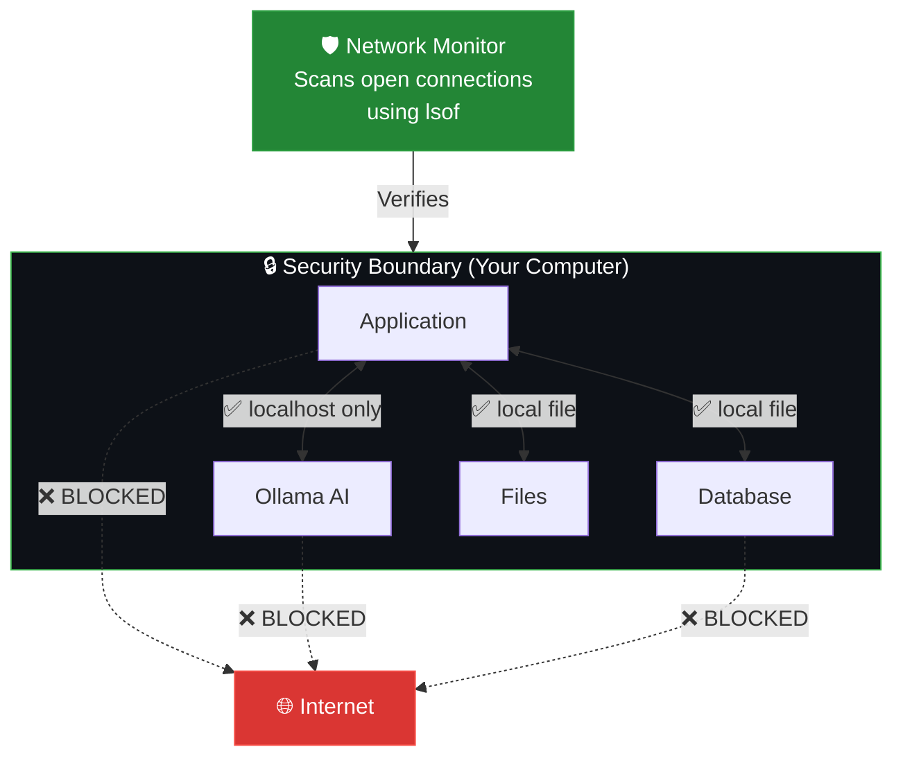
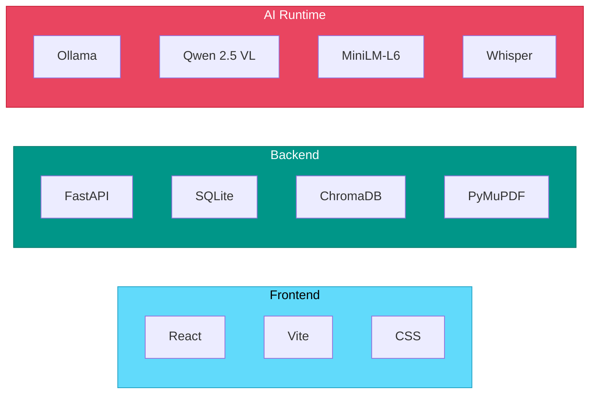

<![CDATA[# 🏭 Sovereign AI Workbench

### Problem Statement ID: **PS-26117** — SIH 2026

> **An AI-powered assistant for industrial plant operations that runs 100% offline — no data ever leaves your computer.**

---

## 📌 What Is This Project?

Imagine you work in an oil refinery or a power plant. Every day, engineers deal with:
- 📄 Hundreds of inspection reports (PDF scans, handwritten notes)
- 🔧 Maintenance procedures that must follow strict safety rules (SOPs)
- 📊 Sensor data from machines (temperature, vibration, pressure)
- 🖼️ Photos of equipment that need expert analysis
- 📝 Official reports that must be generated quickly

**This project is an AI assistant that helps with ALL of these tasks — but with one critical rule:**

> ### 🔒 Everything stays on YOUR computer. Zero data goes to the internet.

No ChatGPT. No cloud APIs. No data leaks. The AI models run **locally on your own machine**, making it safe for **confidential industrial operations**.

---

## 🎯 Key Features (What Can It Do?)

| Feature | What It Does | Who Uses It |
|---------|-------------|-------------|
| 📄 **Document Analysis** | Upload a PDF inspection report → AI reads it, checks it against safety rules, and creates an official approval note | Engineers, Safety Officers |
| 💬 **Knowledge Assistant** | Ask questions in plain English → AI searches your uploaded documents and gives answers with sources | Anyone on the team |
| 🖼️ **Vision Analysis** | Upload a photo of equipment → AI describes what it sees (damage, labels, hazards) | Field Inspectors |
| 🔧 **Maintenance Agent** | Describe symptoms → AI finds matching procedures and safety checks | Maintenance Crew |
| ⚠️ **Safety Agent** | Get instant safety recommendations, PPE requirements, and emergency procedures | Safety Officers |
| 📊 **Analytics Agent** | Upload sensor data (CSV) → AI finds anomalies and threshold violations | Data Analysts |
| 📝 **Report Generator** | Auto-generate professional maintenance/safety reports | Managers |
| 🎤 **Voice Notes** | Speak into your mic → AI converts speech to text | Field Workers |
| 💻 **Coding Agent** | AI writes & runs Python scripts for engineering calculations — in a sandboxed environment | Engineers |
| 🛡️ **Security Monitor** | Real-time dashboard showing "zero data leaked" status | IT / Compliance |

---

## 🧠 AI Models Used

> **All models run locally on your computer using [Ollama](https://ollama.com).**
> No internet connection is needed after initial setup.



| Model | Name | What It Does | Where It Runs |
|-------|------|-------------|---------------|
| 👁️ **Vision** | `qwen2.5vl:3b` | Reads images, scanned PDFs, gauges, labels, and equipment photos | Ollama (localhost) |
| 🤔 **Reasoning** | `qwen2.5vl:3b` | Understands questions, analyzes reports, checks SOP compliance | Ollama (localhost) |
| 💻 **Coding** | `qwen2.5vl:3b` | Generates Python scripts for engineering calculations | Ollama (localhost) |
| 📚 **Embedding** | `all-MiniLM-L6-v2` | Converts text into numbers so the system can search documents by *meaning*, not just keywords | HuggingFace (cached locally) |
| 🎤 **Speech** | `faster-whisper (base)` | Converts spoken audio into written text | CPU (local) |

---

## 🏗️ How It Works — The Big Picture



---

## 📄 Document Agent Flow — The Hero Demo

> *This is the main showcase: Upload a scanned inspection report → Get a professional approval note document.*



**What happens at each step:**

1. **Extract Text** — The system reads every page of the PDF using PyMuPDF (even scanned documents)
2. **Search Knowledge Base** — Finds related SOPs and procedures using semantic search (understanding *meaning*, not just keywords)
3. **AI Reasoning** — The local AI model (`qwen2.5vl:3b`) compares the inspection findings against the SOPs and identifies violations
4. **Generate Document** — Creates a professional `.docx` Approval Note with findings, risk level, and recommended actions
5. **Security Check** — The system verifies that no data left the local machine during the entire process

---

## 💬 Knowledge Assistant Flow



> **Anti-Hallucination Policy**: If the AI can't find the answer in your uploaded documents, it **refuses to guess**. It will clearly say *"No supporting local source found."* This prevents dangerous made-up answers in safety-critical environments.

---

## 💻 Coding Agent Flow



> The Coding Agent generates Python scripts and runs them in a **sandboxed environment with no network access** — so even if the AI-generated code tried to send data somewhere, it physically cannot.

---

## 🛡️ Security Architecture



**Security features:**
- ✅ All AI runs on `localhost:11434` (your computer only)
- ✅ All data stored in local SQLite database and local files
- ✅ Network monitor actively scans for unauthorized connections
- ✅ Coding sandbox blocks all network access
- ✅ Complete audit trail of every action
- ❌ No calls to OpenAI, Google, or any cloud API
- ❌ No telemetry or analytics sent anywhere

---

## 📂 Project Structure

```
sih26117/
│
├── backend/                        ← Python server (the brain)
│   ├── main.py                     ← Main API server (all endpoints)
│   ├── requirements.txt            ← Python packages needed
│   ├── .env.example                ← Configuration template
│   │
│   ├── app/
│   │   ├── agent/
│   │   │   ├── graph.py            ← Agent workflow engine (orchestrates everything)
│   │   │   ├── router.py           ← Smart router (picks the right agent for each task)
│   │   │   ├── prompts.py          ← System prompts for each agent
│   │   │   └── state.py            ← Task state tracker
│   │   │
│   │   ├── api/
│   │   │   ├── tasks.py            ← Task execution API endpoints
│   │   │   └── security.py         ← Security status API endpoints
│   │   │
│   │   ├── models/
│   │   │   ├── registry.py         ← Model registry (which model does what)
│   │   │   └── local_client.py     ← Talks to Ollama (the local AI)
│   │   │
│   │   ├── sandbox/
│   │   │   └── docker_runner.py    ← Isolated code execution environment
│   │   │
│   │   ├── security/
│   │   │   └── network_check.py    ← Network isolation verifier
│   │   │
│   │   ├── schemas/
│   │   │   ├── tasks.py            ← Data models for tasks
│   │   │   └── events.py           ← Data models for events
│   │   │
│   │   └── tools/
│   │       └── document_tools.py   ← Generates .docx approval notes
│   │
│   └── data/                       ← Local storage (database, uploads, artifacts)
│
├── frontend/                       ← Web dashboard (what you see in the browser)
│   ├── src/
│   │   ├── App.jsx                 ← Main dashboard UI
│   │   ├── SovereignWorkbench.jsx  ← Advanced workbench UI with agent tracing
│   │   ├── styles.css              ← All visual styling
│   │   ├── main.jsx                ← App entry point
│   │   └── lib/
│   │       └── api.js              ← API connection helper
│   │
│   ├── index.html                  ← HTML entry point
│   ├── package.json                ← JavaScript packages needed
│   └── vite.config.js              ← Build configuration
│
└── README.md                       ← You are here! 👋
```

---

## 🚀 How to Set Up & Run (Step by Step)

### Prerequisites (What You Need First)

| Tool | Why You Need It | How to Get It |
|------|----------------|---------------|
| **Python 3.10+** | Runs the backend server | [python.org](https://www.python.org/downloads/) |
| **Node.js 18+** | Runs the frontend dashboard | [nodejs.org](https://nodejs.org/) |
| **Ollama** | Runs AI models locally on your computer | [ollama.com](https://ollama.com/) |
| **Git** | Downloads this project | [git-scm.com](https://git-scm.com/) |

### Step 1: Clone the Project

```bash
git clone https://github.com/i-shubhh/DEMO-117.git
cd DEMO-117
```

### Step 2: Install & Start Ollama (The Local AI)

```bash
# Install Ollama (macOS)
brew install ollama

# OR download from https://ollama.com for Windows/Linux

# Start the Ollama server
ollama serve

# Download the AI model (only needed once, ~2GB)
ollama pull qwen2.5vl:3b
```

### Step 3: Set Up the Backend

```bash
cd backend

# Create a virtual environment
python3 -m venv venv
source venv/bin/activate    # On Windows: venv\Scripts\activate

# Install dependencies
pip install -r requirements.txt

# Copy the configuration file
cp .env.example .env

# Start the backend server
uvicorn main:app --host 0.0.0.0 --port 8000 --reload
```

✅ Backend is now running at **http://localhost:8000**

### Step 4: Set Up the Frontend

```bash
# Open a NEW terminal window
cd frontend

# Install dependencies
npm install

# Start the frontend
npm run dev
```

✅ Frontend is now running at **http://localhost:5173**

### Step 5: Open in Your Browser

Go to **http://localhost:5173** — You should see the Sovereign AI Workbench dashboard! 🎉

---

## ⚙️ Configuration

All settings are in `backend/.env`:

```env
OLLAMA_URL=http://localhost:11434/api/generate    # Where Ollama is running
OLLAMA_MODEL=qwen2.5vl:3b                        # Which AI model to use
SOVEREIGN_DATA_DIR=./data                         # Where to store files
WHISPER_MODEL=base                                # Speech-to-text model size
```

---

## 🔌 API Endpoints (For Developers)

| Endpoint | Method | What It Does |
|----------|--------|-------------|
| `/` | GET | Check if the server is running |
| `/health` | GET | Full system health check |
| `/system/status` | GET | Detailed system status with AI model info |
| `/chat` | POST | Ask questions to the Knowledge Assistant |
| `/documents/upload` | POST | Upload & index a document (PDF, TXT, DOCX, CSV) |
| `/documents` | GET | List all uploaded documents |
| `/vision/analyze` | POST | Analyze an uploaded image |
| `/maintenance/analyze` | POST | Get maintenance recommendations |
| `/safety/analyze` | POST | Get safety analysis & PPE recommendations |
| `/failure/analyze` | POST | Root cause failure analysis |
| `/analytics/analyze` | POST | Analyze sensor data for anomalies |
| `/reports/generate` | POST | Generate a professional report |
| `/reports` | GET | List all generated reports |
| `/voice-to-text` | POST | Convert audio to text |
| `/generate-flowchart` | POST | Generate a troubleshooting flowchart |
| `/agents` | GET | List all available AI agents |
| `/audit-logs` | GET | View the complete audit trail |
| `/api/tasks` | POST | Start an advanced agentic task workflow |
| `/api/tasks/{id}` | GET | Check task progress |
| `/api/tasks/{id}/result` | GET | Get task results and artifacts |
| `/api/tasks/{id}/events` | GET | Get real-time execution trace |
| `/api/security/status` | GET | Verify zero-egress security status |

---

## 🧩 Technology Stack



| Layer | Technology | Purpose |
|-------|-----------|---------|
| **Frontend** | React + Vite | User interface (dashboard) |
| **Backend** | Python FastAPI | API server, business logic |
| **Database** | SQLite | Documents, reports, audit logs |
| **Vector DB** | ChromaDB | Semantic document search |
| **PDF Reader** | PyMuPDF | Extract text from PDFs |
| **Doc Writer** | python-docx | Generate .docx reports |
| **AI Runtime** | Ollama | Local model serving |
| **Main AI Model** | Qwen 2.5 VL (3B) | Vision + Language understanding |
| **Embeddings** | all-MiniLM-L6-v2 | Document similarity search |
| **Speech** | faster-whisper | Voice-to-text conversion |

---

## 🤝 Team & Credits

**Problem Statement**: PS-26117, Smart India Hackathon 2026

---

## 📜 License

This project is built for SIH 2026. All rights reserved.
]]>
